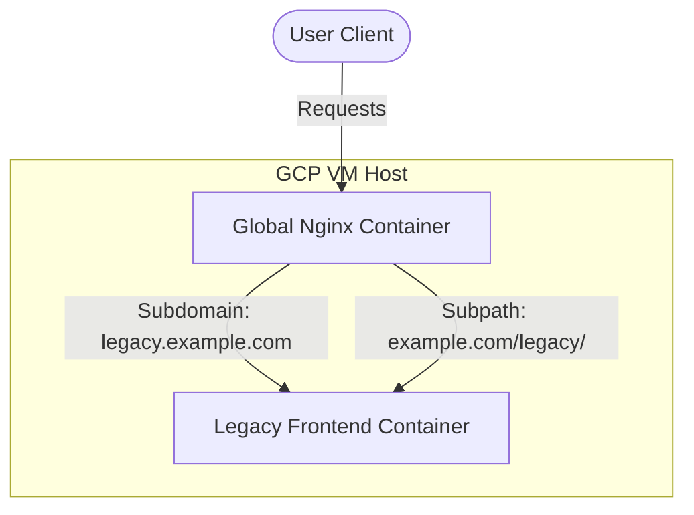

# Deployment and Dockerization Guide

This guide details how to deploy this React + Vite frontend application to a GCP VM using Docker, and configure a global Nginx container to route traffic to it.

---

## Architecture Overview



We configure a multi-stage Docker build:
1. **Build Stage**: Uses Node to install dependencies and run Vite's production build.
2. **Production Stage**: Uses a lightweight Nginx image to serve static files with SPA routing compatibility (`try_files`).

---

## Step 1: Prepare the Files

The following files have been created in the repository:
1. [Dockerfile](file:///C:/Users/harsh/OneDrive/Desktop/legacy/Dockerfile) - Multi-stage Node & Nginx builder.
2. [nginx.conf](file:///C:/Users/harsh/OneDrive/Desktop/legacy/nginx.conf) - Configures the internal container Nginx for client-side routing.
3. [.dockerignore](file:///C:/Users/harsh/OneDrive/Desktop/legacy/.dockerignore) - Excludes local development files from the build.
4. [docker-compose.yml](file:///C:/Users/harsh/OneDrive/Desktop/legacy/docker-compose.yml) - Configuration for running the service.

---

## Step 2: Build and Push the Docker Image

You need to build the Docker image and upload it to a registry so your GCP VM can pull it.

### Option A: Using Docker Hub
1. Build and tag the image (replace `your-username` with your Docker Hub ID):
   ```bash
   docker build -t your-username/legacy-frontend:latest .
   ```
2. Log in to Docker Hub:
   ```bash
   docker login
   ```
3. Push the image:
   ```bash
   docker push your-username/legacy-frontend:latest
   ```

### Option B: Using Google Artifact Registry (GCP Native)
1. Create a Docker repository in GCP Artifact Registry (e.g. `legacy-repo` in region `us-central1`).
2. Authenticate Docker with GCP:
   ```bash
   gcloud auth configure-docker us-central1-docker.pkg.dev
   ```
3. Build and tag:
   ```bash
   docker build -t us-central1-docker.pkg.dev/your-project-id/legacy-repo/legacy-frontend:latest .
   ```
4. Push:
   ```bash
   docker push us-central1-docker.pkg.dev/your-project-id/legacy-repo/legacy-frontend:latest
   ```

---

## Step 3: Run on your GCP VM

SSH into your GCP VM and run the application.

### Option A: Running with Docker Compose (Recommended)
1. Copy the `docker-compose.yml` file to your VM.
2. Update the `image` key in `docker-compose.yml` to point to your pushed image:
   ```yaml
   services:
     legacy-frontend:
       image: your-username/legacy-frontend:latest # or GCP Artifact registry path
       container_name: legacy-frontend
       restart: always
       ports:
         - "8080:80"
       networks:
         - web-network
   ```
3. Start the container:
   ```bash
   docker compose up -d
   ```

### Option B: Running with Raw Docker Run
If you prefer not to use Docker Compose, run:
```bash
docker run -d \
  --name legacy-frontend \
  --restart always \
  -p 8080:80 \
  your-username/legacy-frontend:latest
```

---

## Step 4: Configure Global Nginx Routing

To route traffic from your global Nginx docker container to the `legacy-frontend` container, we have two primary approaches: **Subdomain Routing** or **Subpath/Subdirectory Routing**.

### Network Setup (Crucial for Docker-to-Docker routing)
To allow the global Nginx container to reach the `legacy-frontend` container using its container name as a hostname (instead of routing through the host's public IP), they must share a Docker network.

1. Create a shared network (if not already done):
   ```bash
   docker network create web-network
   ```
2. Connect both containers to the network:
   ```bash
   docker network connect web-network global-nginx-container-name
   docker network connect web-network legacy-frontend
   ```

Now, the global Nginx can forward traffic directly using `proxy_pass http://legacy-frontend:80;`.

---

### Route Configuration 1: Subdomain Routing (Highly Recommended)
*Example: Routing traffic from `legacy.yourdomain.com` to the container.*

Add this server block to your global Nginx configuration (e.g., `/etc/nginx/conf.d/legacy.conf` or inside your main `nginx.conf`):

```nginx
server {
    listen 80;
    server_name legacy.yourdomain.com;

    location / {
        proxy_pass http://legacy-frontend:80; # Connects directly via Docker network
        
        # Standard proxy headers
        proxy_set_header Host $host;
        proxy_set_header X-Real-IP $remote_addr;
        proxy_set_header X-Forwarded-For $proxy_add_x_forwarded_for;
        proxy_set_header X-Forwarded-Proto $scheme;
    }
}
```

---

### Route Configuration 2: Subpath / Subdirectory Routing
*Example: Routing traffic from `yourdomain.com/legacy/` to the container.*

> [!WARNING]
> Vite apps use absolute paths (e.g., `/assets/index.js`) by default. If you host under a subpath like `/legacy/`, you **MUST** update `vite.config.ts` before building, or the app will look for assets at the root domain and fail with 404s.

#### A. Update `vite.config.ts` (If using Subpath)
Modify [vite.config.ts](file:///C:/Users/harsh/OneDrive/Desktop/legacy/vite.config.ts) and add the `base` property:

```typescript
import { defineConfig } from 'vite'
import react from '@vitejs/plugin-react'
import tailwindcss from '@tailwindcss/vite'
import path from "path"

export default defineConfig({
  base: '/legacy/',  // <-- ADD THIS LINE for subpath routing
  plugins: [
    react({
      babel: {
        plugins: [['babel-plugin-react-compiler']],
      },
    }),
    tailwindcss()
  ],
  resolve: {
    alias: {
      "@": path.resolve(__dirname, "./src"),
    },
  },
})
```

#### B. Update the Global Nginx configuration
Add this location block to your existing server configuration block:

```nginx
server {
    listen 80;
    server_name yourdomain.com;

    # Your main website configuration
    location / {
        # ...
    }

    # SEPARATE ROUTE to reach the legacy container
    location /legacy/ {
        proxy_pass http://legacy-frontend:80/; # Note the trailing slash here!
        
        proxy_set_header Host $host;
        proxy_set_header X-Real-IP $remote_addr;
        proxy_set_header X-Forwarded-For $proxy_add_x_forwarded_for;
        proxy_set_header X-Forwarded-Proto $scheme;
    }
}
```

*Note: The trailing slash in `proxy_pass http://legacy-frontend:80/;` strips the `/legacy/` prefix before forwarding the request to the container, which is what the internal Nginx expects.*
